<p align="center">
  
</p>

<h1 align="center">Agora</h1>

<p align="center">
  <strong>The Virtual Marketplace of Opinions</strong><br>
  AI personas debate your product — before you spend real money on market research.
</p>

<p align="center">
  
  
  
  
  
  
</p>

<p align="center">
  <a href="#quickstart">Quickstart</a> &middot;
  <a href="#features">Features</a> &middot;
  <a href="#how-it-works">How It Works</a> &middot;
  <a href="#api">API</a> &middot;
  <a href="#configuration">Configuration</a> &middot;
  <a href="README.de.md">Deutsch</a>
</p>

---

## The Problem

Market research is expensive, slow, and often inconclusive. Focus groups cost five figures, take weeks, and deliver opinions from 12 people. Surveys reach hundreds but only measure what people *say* — not how they *discuss, doubt, and persuade each other*.

## The Solution

**Agora** simulates a virtual society: hundreds of AI personas with individual personalities, values, and opinions react to your product. They post, comment, argue, change their minds — or stay skeptical. You get an analysis report with confidence ratings that tells you **what works, what doesn't, and how certain we are**.

> *Like the ancient Greek agora, voices from all walks of life gather here — advocates, skeptics, experts, institutions — forming emergent opinion dynamics.*

<!-- SCREENSHOT: Dashboard Overview -->
<p align="center">
  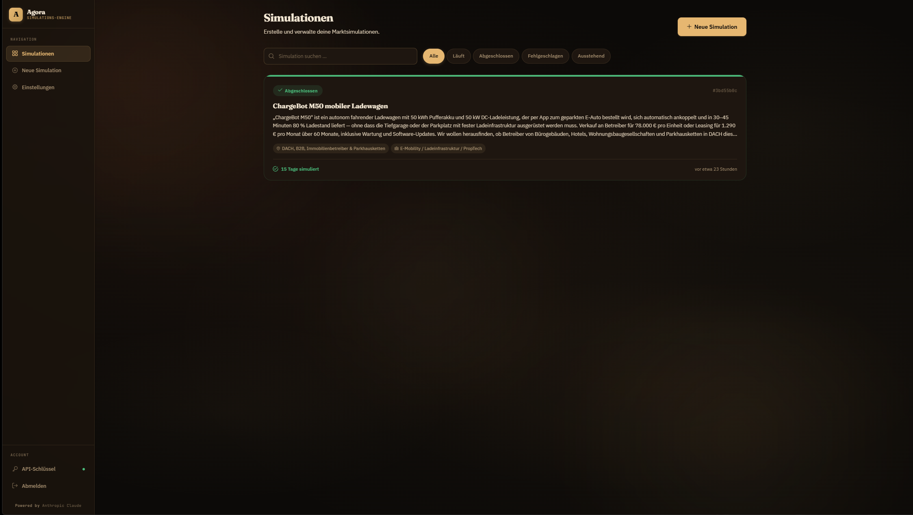
</p>

### Screenshots

<details>
<summary><strong>Overview — Live KPIs & Market Context</strong></summary>
<p>
  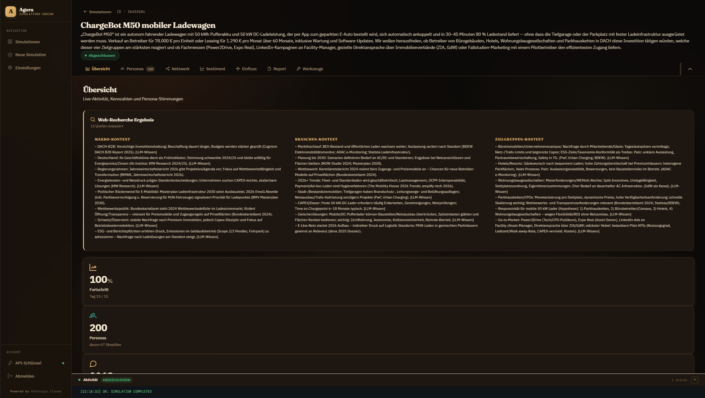
  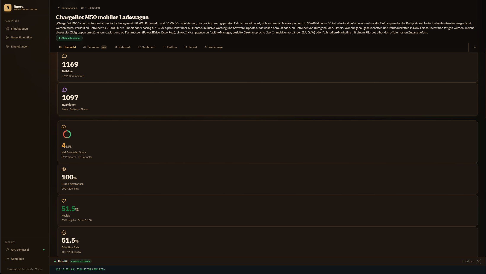
  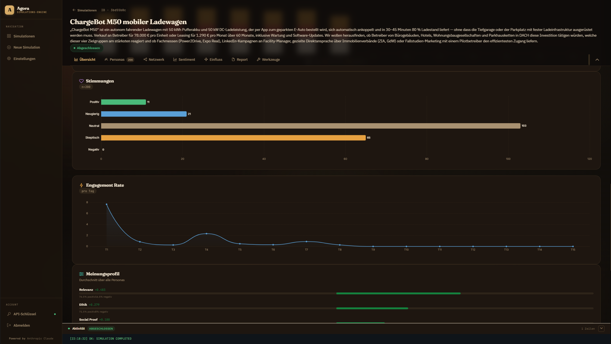
</p>
</details>

<details>
<summary><strong>Personas — 200 AI Agents with Individual Profiles</strong></summary>
<p>
  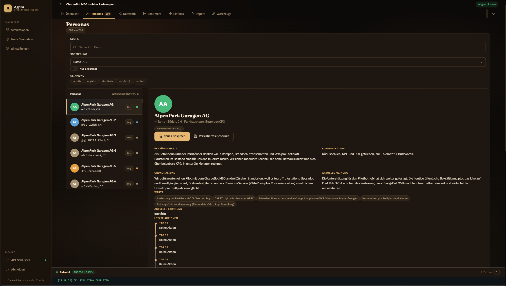
  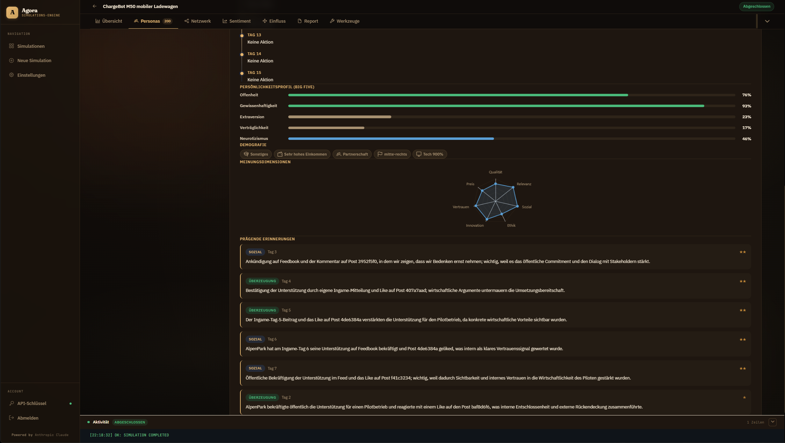
</p>
</details>

<details>
<summary><strong>Network — Force-Directed Interaction Graph</strong></summary>
<p>
  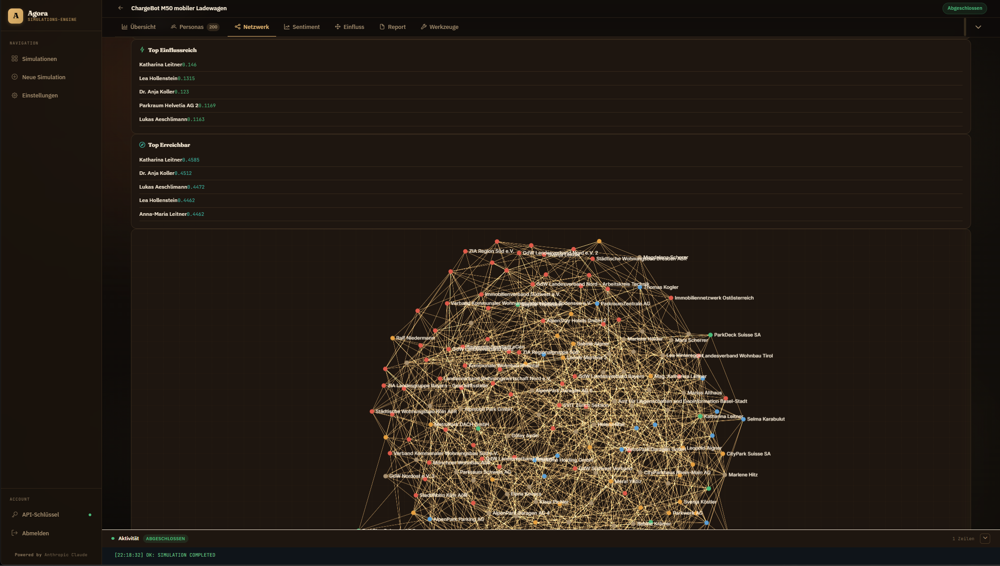
  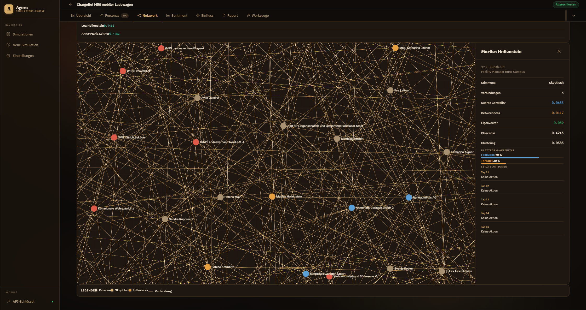
</p>
</details>

<details>
<summary><strong>Sentiment & Influence</strong></summary>
<p>
  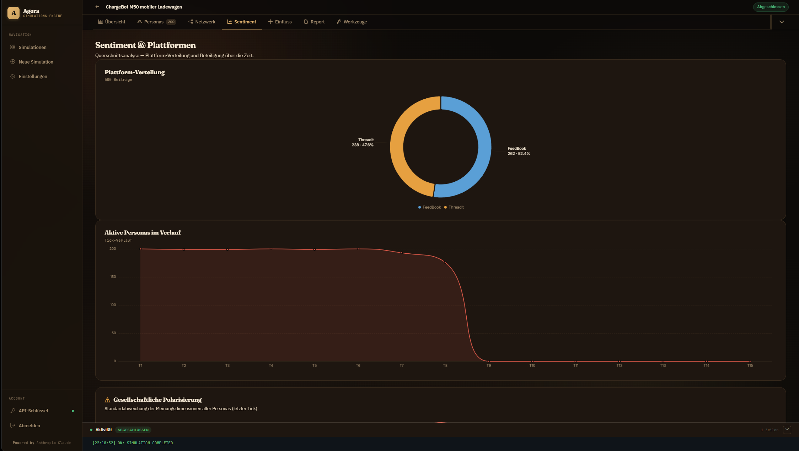
  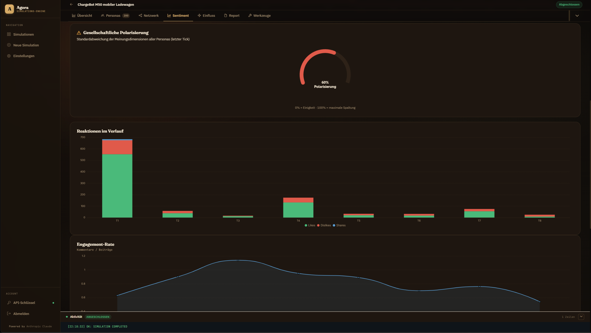
  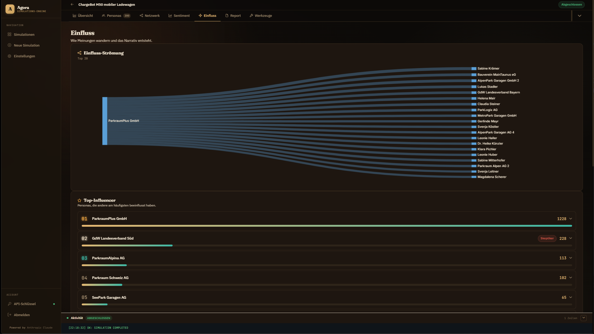
</p>
</details>

<details>
<summary><strong>Analysis Report</strong></summary>
<p>
  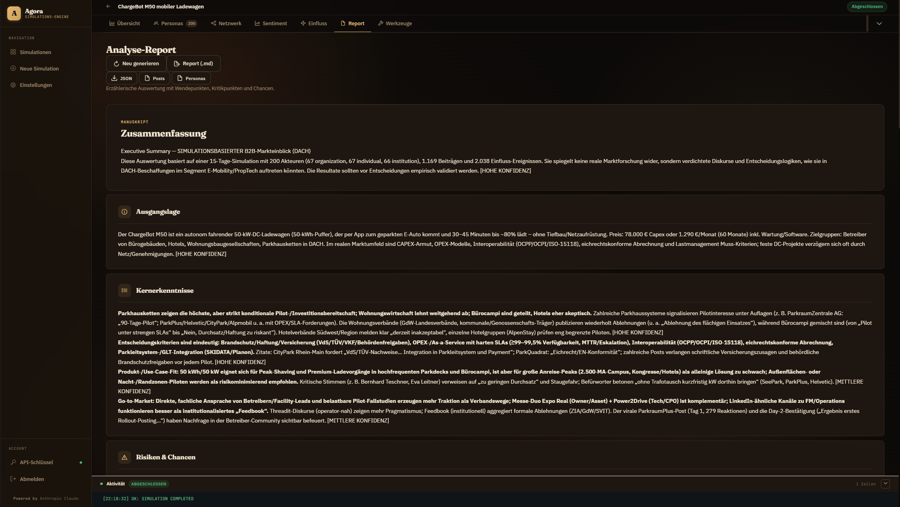
  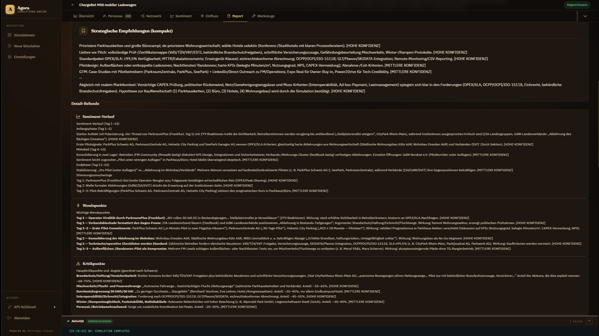
  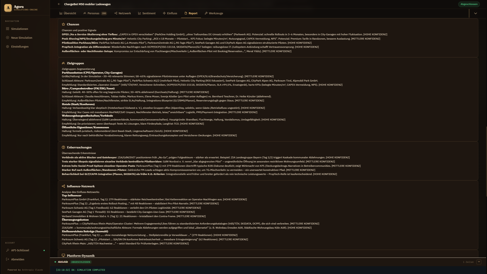
</p>
</details>

---

<h2 id="features">Features</h2>

<table>
  <tr>
    <td width="50%">
      <h3>Virtual Market Research</h3>
      <p>10 to 500 AI personas with Big Five personality traits, demographic profiles, and individual opinions. Distributed along the Rogers Diffusion curve: innovators, early adopters, skeptics, traditionalists.</p>
    </td>
    <td width="50%">
      <h3>Deep Mode: Web Research</h3>
      <p>Before the simulation, Agora automatically researches current market conditions — economy, industry trends, target group sentiment. Personas live in <em>today's</em> reality, not generic LLM training data.</p>
    </td>
  </tr>
  <tr>
    <td>
      <h3>Anti-Echo-Chamber</h3>
      <p>Bounded Confidence, Conviction Strength, Opposing-View Injection, and automatic contrarian posts prevent unrealistic mass conversion. Skeptics stay skeptical — when they should.</p>
    </td>
    <td>
      <h3>Confidence Ratings</h3>
      <p>Every insight in the report is tagged [HIGH], [MEDIUM], or [LOW CONFIDENCE]. The report honestly tells you what's reliable and what needs real-world validation.</p>
    </td>
  </tr>
  <tr>
    <td>
      <h3>Multi-Provider</h3>
      <p>Anthropic Claude, OpenAI GPT-5, Ollama (local) — freely configurable per simulation phase. Provider capabilities are queried dynamically; unsupported parameters are automatically hidden.</p>
    </td>
    <td>
      <h3>Multi-Run & Stress Tests</h3>
      <p>Run the same simulation 3-5 times and measure variance. Sensitivity tests with different skeptic ratios. Remove-and-rerun: remove the most influential actors and check if results hold.</p>
    </td>
  </tr>
</table>


---

<h2 id="how-it-works">How It Works</h2>

```
Create Simulation             Describe product, market, industry
        |
   [Deep Mode?] ----yes----> Web Research (DuckDuckGo + LLM synthesis)
        |                         |
        |                   Review & approve Market Context
        |                         |
        v                         v
  Persona Generation          grounded in current market reality
  (Hybrid: Skeletons              |
   + Enrichment)                   |
        |                          |
        v                          v
  Tick Loop (15-30 simulated days)
  Each day: personas post, comment,
  react, shift opinions
        |
        v
  Automatic Analysis Report
  Sentiment, turning points, segments,
  influence network, confidence levels
```

### Simulation Phases

| Phase | What Happens | Model Tier |
|-------|-------------|------------|
| Web Research | Gather current market data | Smart (Sonnet/GPT-5) |
| Persona Generation | Skeletons + personality enrichment | Smart (parallel) |
| Agent Actions | Posting, commenting, reacting | Fast (Haiku/GPT-5-mini) |
| State Updates | Opinion & mood evolution | Fast (parallel) |
| Analysis Report | Structured market research report | Smart |


---

<h2 id="quickstart">Quickstart</h2>

### Prerequisites

- [Docker](https://docs.docker.com/get-docker/) + Docker Compose
- An [Anthropic API Key](https://console.anthropic.com/) (or OpenAI)

### Setup

```bash
# 1. Clone the repository
git clone https://github.com/your-user/agora.git && cd agora

# 2. Configure environment
cp .env.example .env
# Open .env and add your ANTHROPIC_API_KEY

# 3. Start (builds frontend + backend, starts DB)
docker compose up --build -d

# 4. Wait for the container to be ready (~60 seconds on first run)
docker compose logs -f app
# Wait for: "Application startup complete."
```

### Create Your First API Key

<details>
<summary><strong>Linux / macOS / Git Bash</strong></summary>

```bash
curl -X POST http://localhost:8000/admin/keys \
  -H "Content-Type: application/json" \
  -d '{"name": "My Key"}' \
  -H "X-Admin-Key: change-me-in-production"
```

</details>

<details>
<summary><strong>Windows PowerShell</strong></summary>

```powershell
Invoke-RestMethod -Uri http://localhost:8000/admin/keys -Method POST `
  -ContentType "application/json" `
  -Headers @{"X-Admin-Key"="change-me-in-production"} `
  -Body '{"name":"My Key"}'
```

</details>

### Go

1. Open **http://localhost:8000** in your browser
2. Log in with the API key from the previous step
3. Create your first simulation — done!

---

## Tech Stack

| Layer | Technology |
|-------|-----------|
| **Frontend** | Angular 21, TailwindCSS 4, ECharts, Sigma.js (network graphs) |
| **Backend** | Python 3.12, FastAPI, SQLAlchemy 2.0 (async), Pydantic |
| **Database** | PostgreSQL 16, Alembic (migrations) |
| **LLM** | Anthropic Claude 4.x, OpenAI GPT-5, Ollama (local) |
| **Research** | DuckDuckGo Search (no API key needed) |
| **Infrastructure** | Docker (multi-stage build), SSE (live updates) |

### Architecture

```
                    http://localhost:8000
                           |
              +------------+------------+
              |      Docker Container   |
              |                         |
              |  +-------+  +--------+ |
              |  |Angular|  |FastAPI | |     +----------+
              |  |  SPA  |--|Backend |------>|PostgreSQL|
              |  |       |  |        | |     +----------+
              |  +-------+  +---+----+ |
              |                 |       |
              +------------+----+------+
                           |
                    +------+------+
                    | LLM Provider|
                    | Claude/GPT  |
                    | /Ollama     |
                    +-------------+
```

---

<h2 id="api">API Documentation</h2>

Interactive docs available at: **http://localhost:8000/docs** (Swagger UI)

<details>
<summary><strong>Key Endpoints</strong></summary>

| Endpoint | Description |
|----------|------------|
| `POST /simulations/` | Create simulation |
| `POST /simulations/{id}/run` | Start simulation |
| `GET /simulations/{id}/stream` | Live progress (SSE) |
| `GET /simulations/{id}/market-context` | Web research results |
| `POST /simulations/{id}/research/approve` | Approve research & continue |
| `POST /simulations/{id}/multi-run` | Start multi-run |
| `GET /simulations/multi-run/{group}/compare` | Compare runs |
| `POST /analysis/{id}/generate` | Generate report |
| `GET /analysis/{id}` | Get report |
| `POST /personas/{id}/chat` | Chat with persona |
| `GET /providers/capabilities` | Provider capabilities |
| `GET /providers/{id}/models` | Available models |

</details>

---

<h2 id="configuration">Configuration</h2>

All settings via environment variables (`.env`):

| Variable | Required | Default | Description |
|----------|:--------:|---------|------------|
| `ANTHROPIC_API_KEY` | **Yes** | — | Claude API key |
| `OPENAI_API_KEY` | No | — | OpenAI as alternative provider |
| `ADMIN_MASTER_KEY` | **Yes** | `change-me-in-production` | For API key management |
| `DATABASE_URL` | No | *set by Docker* | PostgreSQL connection |
| `CORS_ORIGINS` | No | `["*"]` | Allowed origins |
| `MAX_CONCURRENT_SIMULATIONS` | No | `3` | Parallel simulations |
| `DEFAULT_AGENT_CONCURRENT_CALLS` | No | `10` | Parallel LLM calls |

---

## What Agora Is NOT

Transparency is part of the product:

- **Not real market research** — Agora generates hypotheses, not proof
- **Not purchase predictions** — personas simulate opinion dynamics, not buying behavior
- **Not a replacement for real customers** — Agora is a pre-screening tool: is a full study worth it?
- **Quantitative claims from personas are not real data** — the report flags this explicitly

---

## Roadmap

- [ ] PDF export for reports
- [ ] Conviction heatmap (how strongly are personas convinced?)
- [ ] A/B comparison: simulate two product descriptions against each other
- [ ] Real-time persona chat during running simulation
- [ ] Webhook integrations (Slack, Teams, n8n)
- [ ] Self-hosted cloud version

---

## License

Proprietary. All rights reserved.

---

<p align="center">
  <sub>Built with Claude, GPT, and mass amounts of coffee. GDPR-native. European.</sub>
</p>
